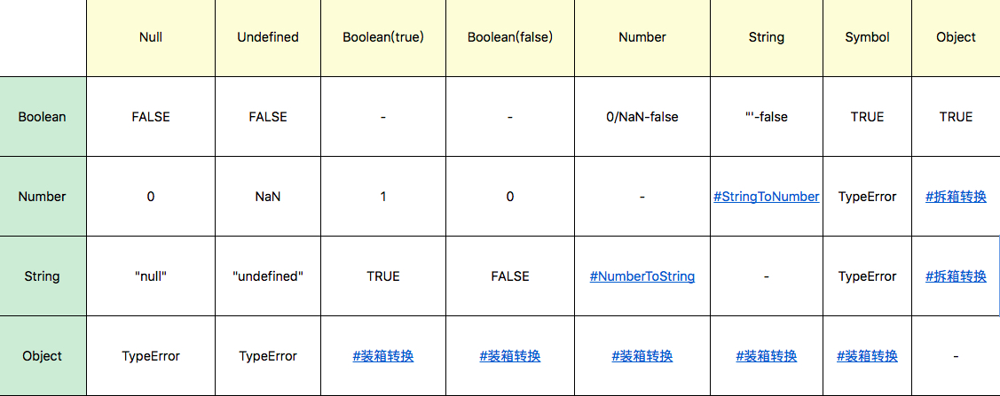

# JavaScript

[toc]


# 1. 运行时


## 1.1 数据结构和数据类型

【动态类型】

> JavaScript 是一种**弱类型**或者说**动态**语言。这意味着你不用提前声明变量的类型，在程序运行过程中，类型会被自动确定。
>
> 运行时类型是代码实际执行过程中我们用到的类型。


### 1.1.1 数据类型


最新的 ECMAScript 标准定义了 8 种数据类型

- - [undefined](https://developer.mozilla.org/zh-CN/docs/Glossary/undefined)：`typeof instance === "undefined"`
  - [Boolean](https://developer.mozilla.org/zh-CN/docs/Glossary/Boolean)：`typeof instance === "boolean"`
  - [Number](https://developer.mozilla.org/zh-CN/docs/Glossary/Number)：`typeof instance === "number"`
  - [String](https://developer.mozilla.org/zh-CN/docs/Glossary/String)：`typeof instance === "string`
  - [BigInt](https://developer.mozilla.org/zh-CN/docs/Glossary/BigInt)：`typeof instance === "bigint"`
  - [Symbol](https://developer.mozilla.org/zh-CN/docs/Glossary/Symbol) ：`typeof instance === "symbol"`
- [null](https://developer.mozilla.org/zh-CN/docs/Glossary/Null)：`typeof instance === "object"`。
- [Object](https://developer.mozilla.org/zh-CN/docs/Glossary/Object)：`typeof instance === "object"`。


原始值：

> 除 Object 以外的所有类型都是不可变的（值本身无法被改变）。
>
> JavaScript 中对字符串的操作一定返回了一个新字符串，原始字符串并没有被改变）。我们称这些类型的值为“原始值”。


Boolean类型

> 布尔表示一个逻辑实体，可以有两个值：`true` 和 `false`。


Null类型

> Null 类型只有一个值： `null`


Undefined类型

> 一个没有被赋值的变量会有个默认值 `undefined`


Number类型

> 根据 ECMAScript 标准，JavaScript 中只有一种数字类型
>
> 基于 IEEE 754 标准的双精度 64 位二进制格式的值 -(2^53 -1) 到 2^53 -1）
>
> +Infinity  -Infinity  NaN

检测是否在范围内

 [`Number.MAX_VALUE`](https://developer.mozilla.org/zh-CN/docs/Web/JavaScript/Reference/Global_Objects/Number/MAX_VALUE) 和   [`Number.MIN_VALUE`](https://developer.mozilla.org/zh-CN/docs/Web/JavaScript/Reference/Global_Objects/Number/MIN_VALUE)

[`Number.isSafeInteger()`]和 [`Number.MIN_SAFE_INTEGER`](https://developer.mozilla.org/zh-CN/docs/Web/JavaScript/Reference/Global_Objects/Number/MIN_SAFE_INTEGER)  和[`Number.MAX_SAFE_INTEGER`](https://developer.mozilla.org/zh-CN/docs/Web/JavaScript/Reference/Global_Objects/Number/MAX_SAFE_INTEGER) 


BigInt类型

> 通过在整数末尾附加 `n `或调用构造函数来创建的。


String类型

> JavaScript的字符串类型用于表示文本数据。它是一组16位的无符号整数值的“元素”。在字符串中的每个元素占据了字符串的位置。第一个元素的索引为0，下一个是索引1，依此类推。字符串的长度是它的元素的数量。


Symbol符号类型

> 符号类型是唯一的并且是不可修改的, 并且也可以用来作为Object的key的值(如下). 


Object 类型

> 在计算机科学中, 对象是指内存中的可以被 [标识符](https://developer.mozilla.org/zh-CN/docs/Glossary/Identifier)引用的一块区域.


### 1.1.2 类型转换

#### 常见类型转换表





#### 字符串 转 数字

> 旧浏览器由于使用旧版本的ECMAScript（ECMAScript版本小于ECMAScript 5，当字符串以"0"开头时默认使用八进制，ECMAScript 5使用的是十进制）。

+ parseInt(string, radix)

​		radix：表示要解析的数字的基数（2-36）位	，ECMAScript 5环境下默认是10

+ parseFloat(string)
+ Number(string) —–建议使用


#### 数字 转  字符串

+ 短数字  
  13+‘’
  …
+ 长数字（科学计数法）
  不适用


#### 装箱转换

> + 每一种基本类型Number、String、Boolean、Symbol在对象中都有对应的类，所谓装箱转换，正是把基本 类型转换为对应的对象，它是类型转换中一种相当重要的种类。
>
> + 全局的 Symbol 函数无法使用 new 来调用
>
>   ```javascript
>   var symbolObject = (function(){ return this; }).call(Symbol("a"));
>   console.log(typeof symbolObject); //object console.log(symbolObject instanceof Symbol); //true console.log(symbolObject.constructor == Symbol); //true
>   ```
>
>   
>
> + 装箱机制会频繁产生临时对象
>
> + 使用内置的 Object 函数，我们可以在JavaScript代码中显式调用装箱能力。
>
>   ```javascript
>   var symbolObject = Object(Symbol("a"));
>   console.log(typeof symbolObject); //object console.log(symbolObject instanceof Symbol); //true console.log(symbolObject.constructor == Symbol); //true
>   ```
>
>   


#### 拆箱转换

隐式拆箱转换

> 在JavaScript标准中，规定了 ToPrimitive 函数，它是对象类型到基本类型的转换（即，拆箱转换）。
>
> 对象到 String 和 Number 的转换都遵循“先拆箱再转换”的规则。通过拆箱转换，把对象变成基本类型， 再从基本类型转换为对应的 String 或者 Number。
>
> 拆箱转换会尝试调用 valueOf 和 toString 来获得拆箱后的基本类型.


显示拆箱转换

​	ES6之后出现 显示拆箱转换`toPrimitive Symbol`来覆盖原有隐式拆箱转换的行为

语法

`toPrimitive(o[ , PreferredType ] )`

```javascript
    var o = {
        valueOf : () => {console.log("valueOf"); return {}},
        toString : () => {console.log("toString"); return {}}
    }

    o[Symbol.toPrimitive] = () => {console.log("toPrimitive"); return "hello"}


	//隐式拆箱转换 会尝试调用valueOf 和 toString
    console.log(o + "")
    // toPrimitive
    // hello
```


### 1.1.3 类型检测


typeof

instanceof

constructor 

Object.prototype.toString.call(obj);


### 1.1. 4 应用和机制

应用和机制


#### 1.1.4.1  js之面向对象


【人类自然对象的定义】：

1. 看得见摸得着的东西
2. 人类智商可理解的东西
3. 人类可指导思考或行为的东西

 

【面向对象的特点】：

+ 对象具有唯一标识性
+ 对象有状态
+ 对象有行为


【javascript中的对象】

+ 唯一性：唯一的内存地址
+ 状态和行为统一抽象为“属性”
+ js中对象特有的特殊：对象具有高度的动态性，这是因 为JavaScript赋予了使用者在运行时为对象添改状态和行为的能力


js对象的两类属性

1. 数据属性
   + value
   + writeable
   + enumerable
   + congigurable
2. 访问器属性
   + getter
   + setter
   + enumerable
   + congigurable


如何产生数据属性？

定义属性的代码会产生数据属性

```javascript
var o = { a: 1 }; 
o.b = 2; //a和b皆为数据属性 
Object.getOwnPropertyDescriptor(o,"a") // {value: 1, writable: true, enumerable: true, configurable: true} Object.getOwnPropertyDescriptor(o,"b") // {value: 2, writable: true, enumerable: true, configurable: true
```

定义访问器属性[Object.defineProperty(obj,attr,{…})]

```javascript
var o = { a: 1 }; 
Object.defineProperty(o, "b", {value: 2, writable: false, enumerable: false, configurable: true}); 
//a和b都是数据属性，但特征值变化了 
Object.getOwnPropertyDescriptor(o,"a"); 
// {value: 1, writable: true, enumerable: true, configurable: true} 
Object.getOwnPropertyDescriptor(o,"b"); 
// {value: 2, writable: false, enumerable: false, configurable: true} 
o.b = 3; 
console.log(o.b); 
// 2
```


访问器属性

使用get set创建

```javascript
var o = { 
  get a() { return 1 } 
}; 
console.log(o.a); // 1
```

注意：每次访问属性，访问器属性都会执行getter或者setter函数


#### 1.1.4.2 js对象机制

【原型】：原型是顺应人类自然思维的产物。

+ 最为成功的流派是使用“类”的方式来描述对象。——–基于类的编程语言的流派

+ 利用原型来描述对象—————–基于原型的编程语言的流派


原型系统的特点：更多与高动态性语言配合，并且多数基于原型的语言提倡运行时的原型修改


​	

不管是基于类还是基于原型，目标都是实现复用和抽象。

原型系统的**复制操作**

+ 使新对象持有一个对原型的引用（js采用这种）

  ```javascript
  function Cat(name,age){
    this.name = name;
    this.age = age;
    this.say = function(){
      console.log("Cat Cat Cat");
    }
  }
  
  //通过原型prototype的引用，获取到原型对象的数据属性和访问器属性
  var c1 = new Cat('Tiki');
  c1.say();//"Cat Cat Cat"
  ```

  

+ 切实复制，创建一个新的对象


**js的原型**

+ 原型链机制


ES6之后，使用

+ Object.create 根据指定的原型创建新对象，原型可以是null；

+ Object.getPrototypeOf 获得一个对象的原型； 

+ Object.setPrototypeOf 设置一个对象的原型。


运行时的原型工作原理

1. ES3S时期js中的‘类’，私有属性[[class]]，唯一访问方式 Object.prototype.toString()
   仅仅是运行时的一个字符串属性

2. ES5时期 ，js中的私有属性[[class]]被 `Symbol.toStringTag `代替

   ```javascript
   var o = { 
     [Symbol.toStringTag]: "MyObject" 
   } ;
   console.log(o + "");
   //[object Myobject]
   ```

   

3. new 操作符(接收一个构造器和一组调用参数)

   + 以构造器的prototype属性为原型，创建新对象
   + 将this和调用参数传给构造器，执行。
   + 如果构造器返回的是对象，则返回；否则，返回第一步创建的对象。

   ```javascript
   //new 这样的行为为函数对象提供了两种添加属性的方式
   //方式1  在构造器中添加属性
   function c1(){ 
     this.p1 = 1; 
     this.p2 = function(){ 
       console.log(this.p1);
   	};
   } ;
   var o1 = new c1; 
   o1.p2();
   //方式2  在构造器的prototype属性上添加属性
   function c2(){ };
   c2.prototype.p1 = 1;
   c2.prototype.p2 = function(){ 
     console.log(this.p1);
   }
   var o2 = new c2; 
   o2.p2();
   ```

   

4. ES6中的类

   > ES6中引入了class关键字，并且在标准中删除了所有[[class]]相关的私有属性描述，类的概念正式从属性升 级成语言的基础设施

```javascript
class Rectangle { 
  constructor(height, width) { 
    this.height = height; 
    this.width = width;
	} 
  // Getter 
  get area() { 
    return this.calcArea();
	}
	// Method 
  calcArea() { 
    return this.height * this.width;
	} 
}
```

逻辑上JavaScript认为每个类是有共同原型的一组对象，类中 定义的方法和属性则会被写在原型对象之上。

类中的继承 extends

```javascript
class Animal { 
  constructor(name) { 
    this.name = name;
	}
	speak() { 
    console.log(this.name + ' makes a noise.');
	} 
}

class Dog extends Animal { 
  constructor(name) { 
    super(name); 
    // call the super class constructor and pass in the name parameter
    //调用父类（超类）的构造函数，并传入name 参数
    //这里是 自动调用父类的构造函数
	}
 
  //Methods
	speak() { 
 	 	console.log(this.name + ' barks.');
	} 
}
let d = new Dog('Mitzie'); 
d.speak(); 
// Mitzie barks.
```


#### 1.1.4.3 js中的对象分类

+ 宿主对象（host Objects）由JavaScript宿主环境提供的对象

  例如：全局对象window上的属性，一部分来自js语言，一部分来自浏览器环境

  + 固有对象 

    ```javascript
    //Image 构造器
    let img = new Image();
    ```

    

  + 用户可创建的对象

    ```javascript
    let div = document.creatElement('div');
    ```

    

  


+ 内置对象（Built-in Objects）由JavaScript语言提供的对象。

  + 固有对象（Intrinsic Objects ）：由标准规定，随着JavaScript运行时创建而自动创建的对象实例。

    ```javascript
    //基础库的角色，js代码执行前就被创建出来了。
    //ECMA 提供了150+个固有对象
    ```

    

  + 原生对象（Native Objects）：可以由用户通过Array、RegExp等内置构造器或者特殊语法创建的对 象。

    > js中能够通过语言本身的构造器创建的对象——–原生对象
    >
    > js中有30+个构造器

    

  + 普通对象（Ordinary Objects）：由{}语法、Object构造器或者class关键字定义类创建的对象，它能够 被原型继承。


## 1.2 执行过程（算法）


## 1.3 浏览器工作原理

对浏览器的实现者来说，他们做的事情，就是把一个URL变成一个屏幕上显示的网页

1.  浏览器首先使用HTTP协议或者HTTPS协议，向服务端请求页面；
2.  把请求回来的HTML代码经过解析，构建成DOM树； 
3.  计算DOM树上的CSS属性； 
4.  最后根据CSS属性对元素逐个进行渲染，得到内存中的位图；
5.  一个可选的步骤是对位图进行合成，这会极大地增加后续绘制的速度；
6.  合成之后，再绘制到界面上。


【HTTP协议】

HTTP标准由IETF组织制定，跟它相关的标准主要有两份：

1. HTTP1.1 https://tools.ietf.org/html/rfc2616
2. HTTP1.1 https://tools.ietf.org/html/rfc7234

HTTP协议是基于TCP协议出现的，对TCP协议来说，TCP协议是一条双向的通讯通道，HTTP在TCP的基础 上，规定了Request-Response的模式。这个模式决定了通讯必定是由浏览器端首先发起的。


# 2. 文法


## 2.1 词法


## 2.2 语法


# 3. 语义


